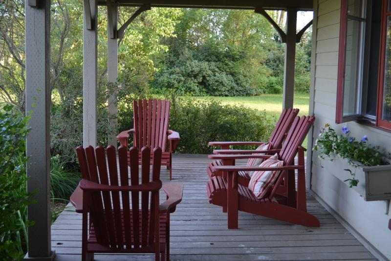

# BOY SCOUTS TO THE RESCUE.
Farmer Hiram Applegate had just finished breakfast. For this
reason, perhaps, he felt exceptionally good-humored. Even the
news he had read in his morning paper (of the day before) to the
effect that his pet abomination and aversion, The Boy Scouts, had
held a successful and popular review in New York and received
personal commendation from the President failed to shake his
equanimity.
Outside the farmhouse the spring sun shone bright and warm. The
air was crisp, and odorous with the scent of apple blossoms.
Robins twittered cheerily, hens clucked and now and then a blue
bird flashed among the orchard trees.

As Hiram stepped out on his “vendetta,” as he called his
verandah—or, to use the old-fashioned word and the better one,
“porch”—he was joined by a rather heavy-set youth with small, 
shifty eyes and a sallow skin which gave the impression of
languishing for soap and water. A suit of loud pattern, new yellow
boots with “nobby” toes, and a gaudy necktie did not add to young
Jared Applegate‟s general appearance.
“Pop,” he began, after a glance at the old man‟s crabbed and
wrinkled features, just then aglow with self-satisfaction, “Pop, how
about that money I spoke about?”
Old Applegate stared at his offspring from under his heavy, irongray brows.
“A fine time to be askin‟ fer money!” he snorted indignantly, “you
just back frum Panamy—under a cloud, too, and yet you start a
pesterin‟ me fer money as ef it grew on trees.”
“What d‟ye want it fer, hey?” he went on after a pause. “More Bye
Scut nonsense?”
Jared shook his head as if denying some discreditable imputation.
“I‟ve had nothing to do with the Boy Scouts since the day I was
kicked out of—that is, since I left the Black Wolf troop in New
York.”
“Dum glad of it, though you never tole me what you quit for,”
muttered the old man.
“But to get back to that money,” said Jared; “as I told you when I
got back from the Isthmus, I need it. Need it bad, too, or I wouldn‟t
ask you.”
“Makes no diff‟rence. What d‟ye want it fer,—hey?” he repeated,
coming back to his original question.
Jared decided that there was nothing for it but to tell the truth.
“To go over what I told you the other night once more, I‟m in debt.
Debts I ran up on the Isthmus,” was the rejoinder. “A chap can‟t
live down there for nothing you know, and—”
“By heck! You got a dern good salary as Mr. Mainwaring‟s sec‟ty,
didn‟t yer, an‟ a chance ter learn engin-e-ring thrun in. You git
fired fer misbehavin‟ yerself an‟ then yer come down on the old
man fer money. I ain‟t goin‟ ter stand it, I ain‟t, and that‟s flat!”
The old man knocked the ashes out of his half-smoked pipe with
unnecessary violence. Jared, eying him askance, saw that his father
was working himself up into what Jared termed “a tantrum.”
Taking another tack, he resumed.
“Sho, pop! It ain‟t as if you weren‟t going to get it back. And
there‟ll be interest at six per cent., too.”
This was touching old Applegate on a tender point. If rumor in and
about Hampton spoke correctly, the old man had made most of his
large fortune, not so much by farming, but by running, at ruinous
rates, a sort of private bank.
“Wa‟al,” he said, his hard, rugged old face softening the least bit,
“uv course you‟ve tole me all that; but what you h‟aint tole me is,
how yer a goin‟ ter git ther money back,—an‟ the interest.”
He looked cunningly at his son as he spoke. Jared hesitated an
instant before he replied. Then he said boldly enough:—
“I can‟t tell you just what the business enterprise is that I expect to
go into shortly. I‟m—I‟m under a sort of promise not to, you see.
But if everything goes right, I‟ll be worth a good round sum before 
long.”
“Promises ain‟t security,” retorted the old man warily. “I—Gee
Whitakers! Thar‟s that spotted hawg out agin!”
Across the dusty road the animal in question was passing as the
farmer‟s eyes fell on it. In the center of the track it paused and
began rooting about, grunting contentedly at its liberty.
At the same moment a humming sound, almost like the drone of a
big bumble bee, came out of the distance. As he heard the peculiar
drone, a quick glance of recognition flashed across old Applegate‟s
face.
“It‟s that pesky Mainwaring gal an‟ her ‟lectric auto!” he exploded
vehemently. “That makes the third time in ther last two weeks that
Jake‟s bin out when she come along. Ther fust time she knocked
him over, ther second time she knocked him over, an‟ now—”
A smart-looking little electric runabout, driven by a pretty young
girl in motoring costume, whizzed round the corner. The ill-fated
Jake looked up from his rooting as the car came dashing on.
Possibly the recollection of those other two narrow escapes was
upon him. At any rate, with a scared grunt and an angry squeal, he
whisked his stump of a curly tail in the air and dashed for the
picket fence in front of the Applegate place.
But either Jake was too slow, or the electric was too fast. Just as
the girl gave the steering wheel of the auto a quick twist to avoid
the pig, one of the forewheels struck the luckless Jake “astern,” as
sailors would say.
With an agonized wail Jake sailed through the air a few feet and
then, alighting on his feet, galloped off unhurt but squealing as if 
he had been mortally injured.
“Goodness,” exclaimed the girl alarmedly, and then, “gracious!”
The quick twist of the wheel had caused the car to give a jump and
a skid and land in the ditch, where it came to a standstill. Farmer
Applegate, rage tinting his face the color of a boiled beet, came
storming down the path.
“This is the time I got yer, hey?” he shouted at the alarmed
occupant of the auto. “That makes three times you run over Jake.
You got away them other times, but I got yer nailed now. Kaint git
yer car out uv ther ditch, hey? Wa‟al, it‟ll stay thar till yer pay up.”

